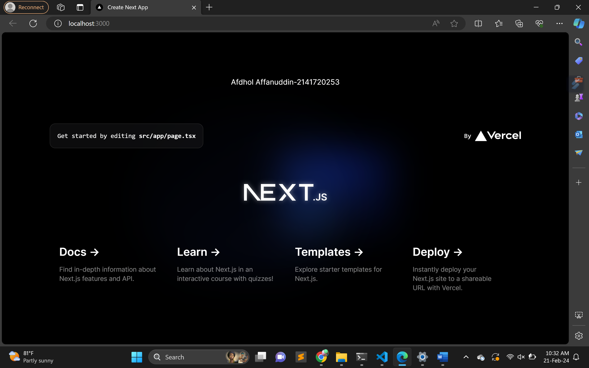
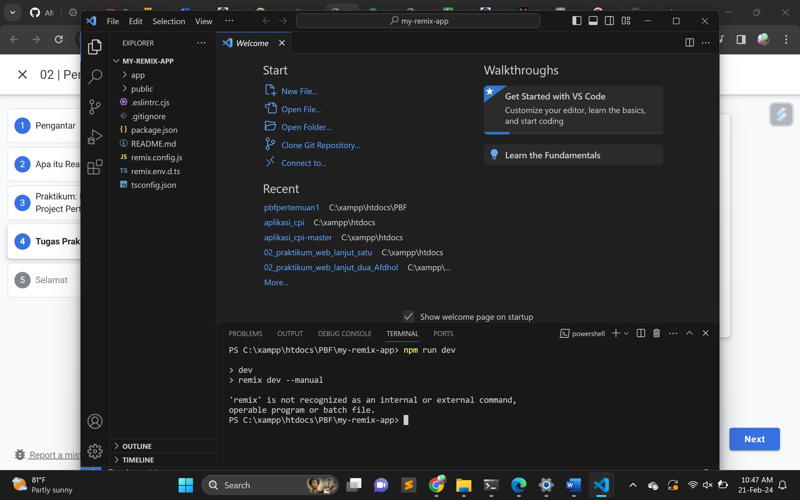
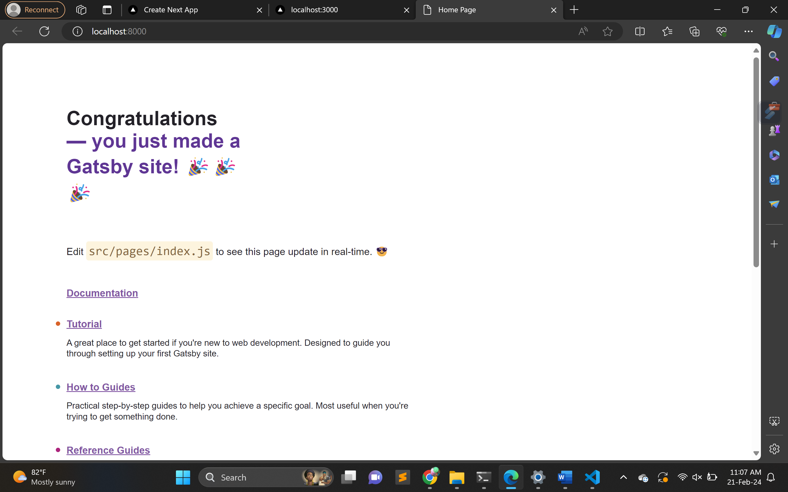

1.
TypeScript:
TypeScript adalah superset dari JavaScript yang memungkinkan penggunaan tipe data statis. Ini berarti Anda dapat menentukan tipe data untuk variabel, parameter fungsi, dan nilai kembali dari fungsi. TypeScript membantu dalam mencegah kesalahan yang umum terjadi pada tahap pengembangan dengan memberikan dukungan penuh untuk fitur-fitur JavaScript, serta menambahkan tipe data yang kuat.

ESLint:
ESLint adalah alat untuk menganalisis dan menemukan kesalahan dalam kode JavaScript atau TypeScript. Ini membantu menjaga kualitas kode dengan memberikan pedoman atau aturan (linting rules) yang dapat dikonfigurasi. Dengan menggunakan ESLint, tim pengembang dapat memastikan bahwa kode mereka mematuhi standar tertentu dan menghindari pola kode yang dapat menyebabkan kesalahan atau masalah keamanan.

Tailwind CSS:
Tailwind CSS adalah kerangka kerja CSS yang bersifat utility-first, yang berarti Anda membangun antarmuka pengguna dengan menggabungkan kelas-kelas kecil untuk mencapai desain yang diinginkan. Tailwind menyediakan sekumpulan kelas-kelas yang dapat langsung digunakan untuk mengatur tata letak, warna, tipografi, dan elemen-elemen UI lainnya. Ini memungkinkan pengembang untuk membuat desain dengan cepat tanpa harus menulis banyak kode CSS khusus.

App Router:
App Router (Router Aplikasi) merujuk pada suatu komponen atau alat dalam pengembangan perangkat lunak yang digunakan untuk mengelola navigasi atau perpindahan antar halaman dalam suatu aplikasi web atau aplikasi berbasis platform lainnya. Router biasanya menangani URL dan memastikan bahwa ketika pengguna berinteraksi dengan aplikasi (misalnya, mengeklik tautan), tampilan atau halaman yang sesuai ditampilkan.

Import Alias:
Import Alias merujuk pada teknik di mana Anda memberikan alias atau nama singkat untuk modul atau berkas yang diimpor dalam kode. Ini membantu meningkatkan keterbacaan dan mempermudah perubahan struktur proyek. Dengan menggunakan alias, Anda dapat merujuk ke modul atau berkas dengan nama yang lebih singkat dan mudah diingat, tanpa harus mengganti semua rujukan modul yang sudah ada di kode. Ini juga memudahkan manajemen dependensi dalam proyek yang lebih besar.
2.
-node_modules berisi paket-paket modul Nodejs; semua library yang kita install dengan npm akan disimpan di sini.
-public berisi file untuk publik seperti HTML, CSS, icon, dan gambar, dan aset publik lainnya;
-src berisi kode dari aplikasi Reactjs, di sinilah kita akan membuat komponen;
-.gitignore berisi kode-kode yang akan diabaikan oleh Git.
-package.json file JSON yang berisi keterangan proyek dan daftar modul-modul yang dibutuhkan.
-.eslintrc.js adalah berkas konfigurasi untuk ESLint dalam format JavaScript. ESLint adalah alat linter untuk JavaScript dan TypeScript yang membantu menganalisis kode dan menemukan kesalahan atau potensi masalah dalam gaya atau praktik penulisan kode. 
-.eslintrc.json adalah berkas konfigurasi untuk ESLint dalam format JSON. ESLint adalah alat linter untuk JavaScript dan TypeScript yang membantu menganalisis kode dan menemukan kesalahan atau potensi masalah dalam gaya atau praktik penulisan kode
-next.config.mjs adalah berkas konfigurasi untuk aplikasi Next.js dalam format ECMAScript module (ESM). 
-next-env.d.ts adalah berkas TypeScript Declaration (dengan ekstensi .d.ts) yang digunakan dalam proyek Next.js untuk menyediakan definisi tipe khusus atau pengaturan khusus untuk TypeScript.
-package-lock.json adalah file yang digunakan dalam proyek Node.js untuk mengunci versi dari setiap paket yang digunakan dalam proyek. 
3. 
4. 
perbedaanya pada tampilan dan juga komponenya, juga pada cara installasionya