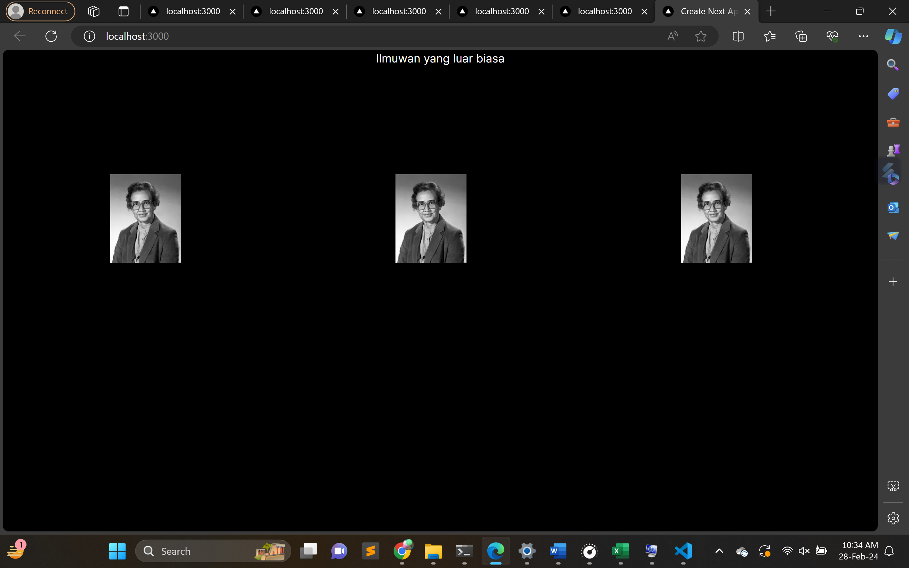
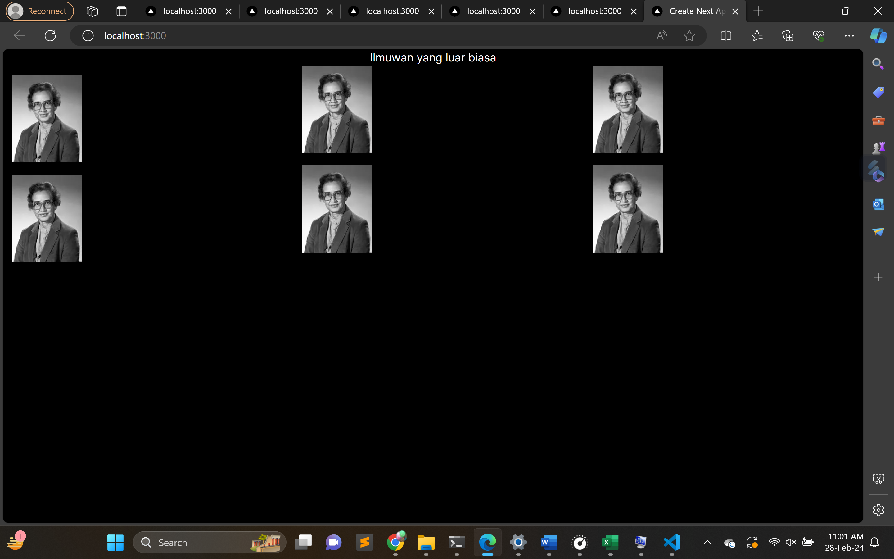
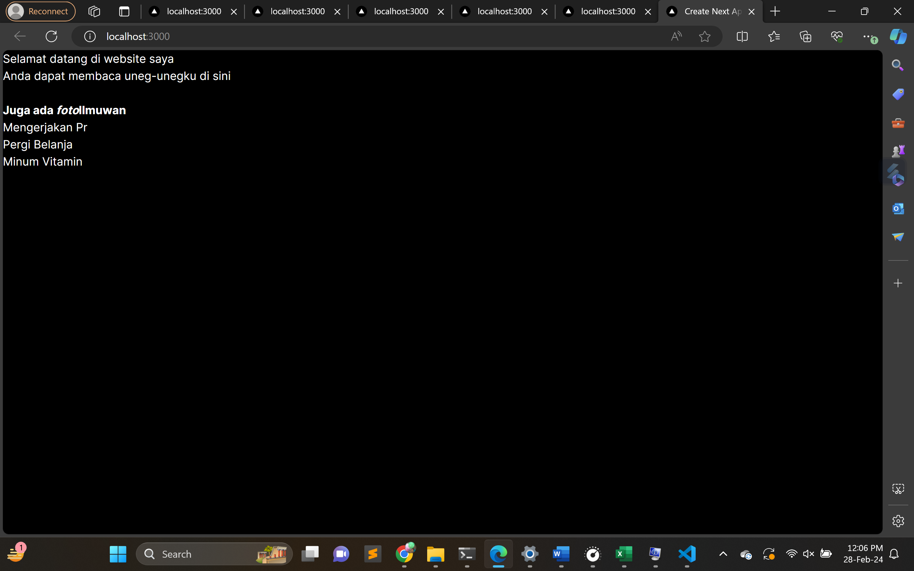
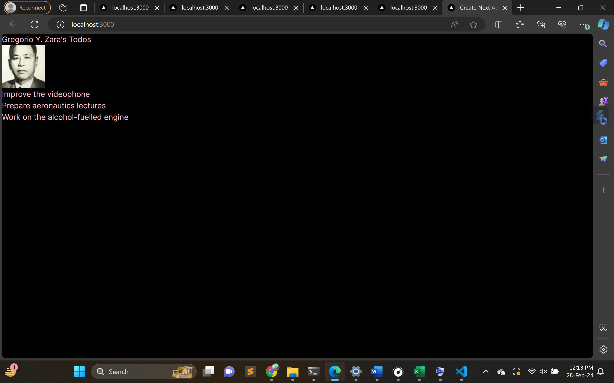

Praktikum 03
Jawaban
1. Kita harus mengimport gambar yang ada di next js nya sesuai domain yang ada, sehingga gambar bisa ditampilkan, caranya dengan menambahkan kode program di next.config.mjs

lalu sesuaikan tampilan sesuai soal

2. Membuat Template layout di folder baru, sehingga tinggal memanggil function tersebut dan hasilnya sama dengan langkah sebelumnya

3. Mengkonvert teks html ke jsx menggunkan konvert vscode

4. Mengubah {person} ke {person.name} untuk memanggil object person

5. Hasilnya sama, menurut saya cuma memasukkan ke dalam objek urlnya
