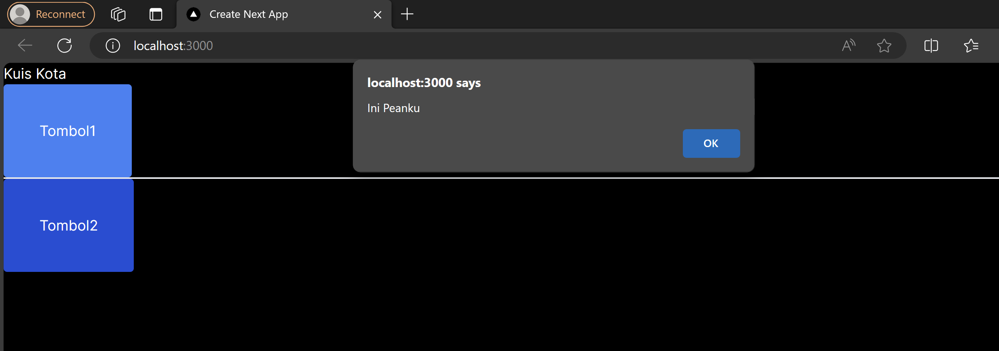
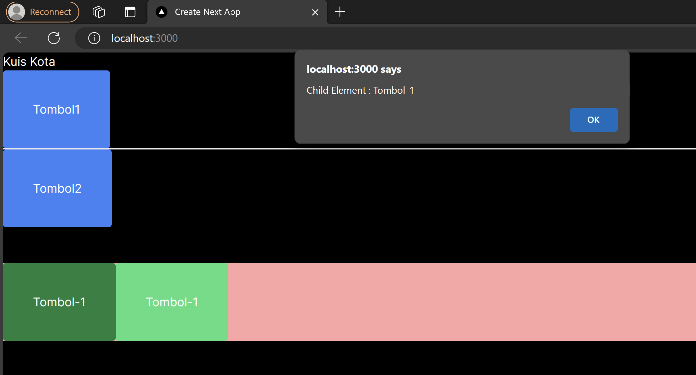
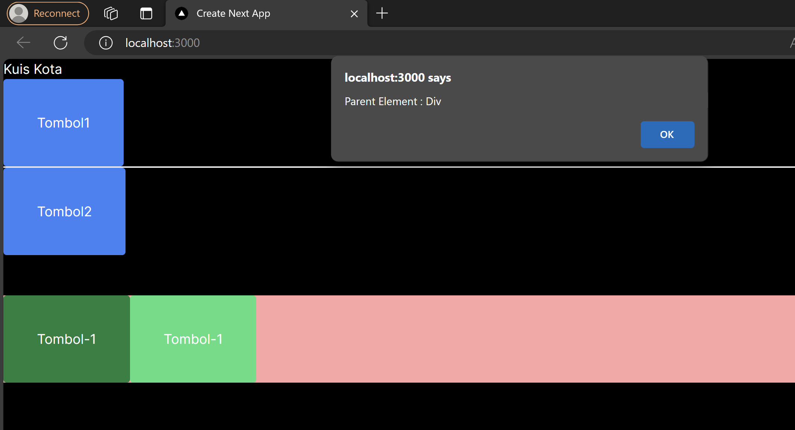

Praktikum 1
- Langkah 1
Membuat element event untuk sebuah button dan juga membuat event handler

- Langkah 2
Menambahkan alert ke element tombol

Praktikum 2

Menambahkan element button dengan sebuah parameter

Praktikum 3
- Langkah 1
Menambahkan parent dan child alert
child

parent
