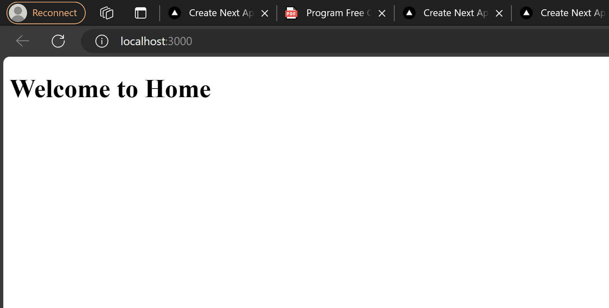
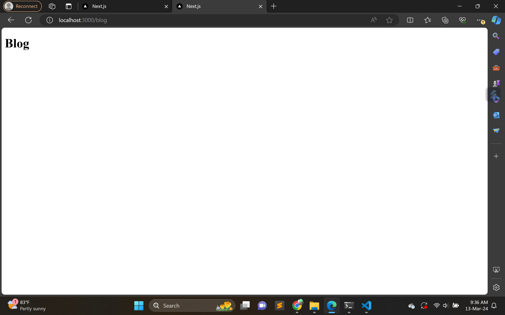
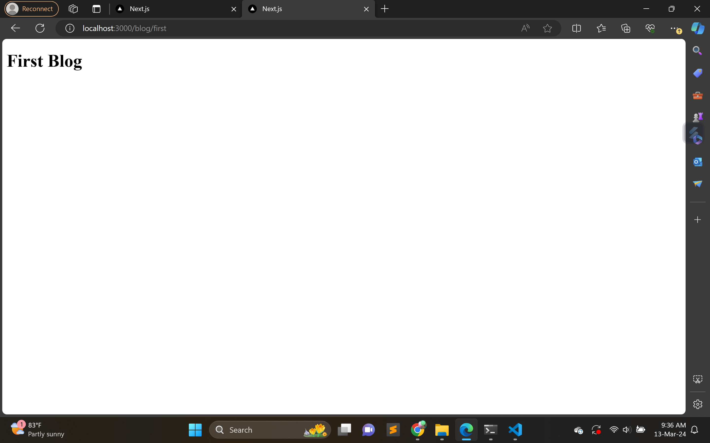
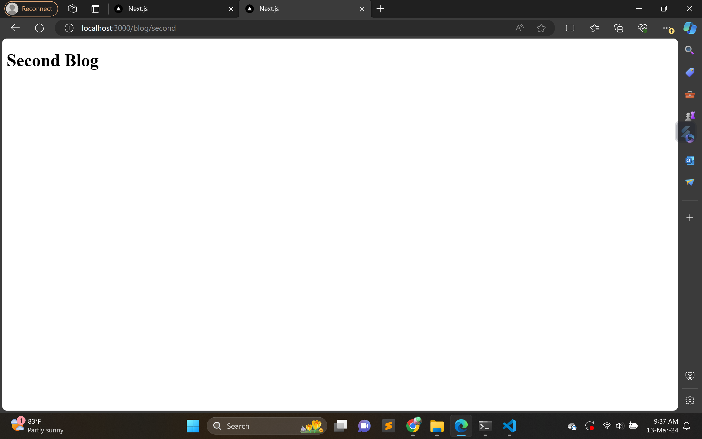

Pertemuan 5 Routing
1. Praktikum 1
menampilkan halaman page di setiap folder about dan home menggunakan routing

Tugas
membuat folder profile lalu menampilkan biodata

2. Praktikum 2
Membuat routing bersarang
blog

firstblog

secondblog
