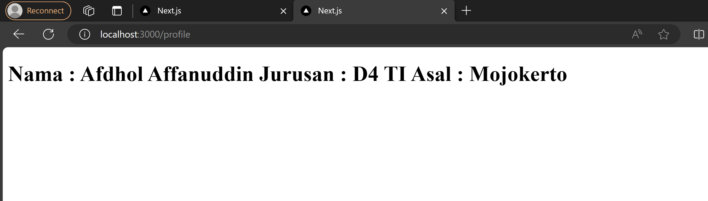

Pertemuan 5 Routing
1. Praktikum 1
menampilkan halaman page di setiap folder about dan home menggunakan routing

Tugas
membuat folder profile lalu menampilkan biodata

2. Praktikum 2
Membuat routing bersarangn pada halaman blog
blog

firstblog

secondblog

3. Praktikum 3
Membuat dynamic routing
products

id 1

id 2

id 3

Todo 1
blog

blog1

blog2

Todo 2
products/[productId]/review

products/[productId]/review/1

products/[productId]/review/2

4. Praktikum 4
Menggunakan nav link, sehingga tinggal mengklik otomatis merouting
Home

Profile

About

Blog

Products

5. Tugas Pertemuan 5
